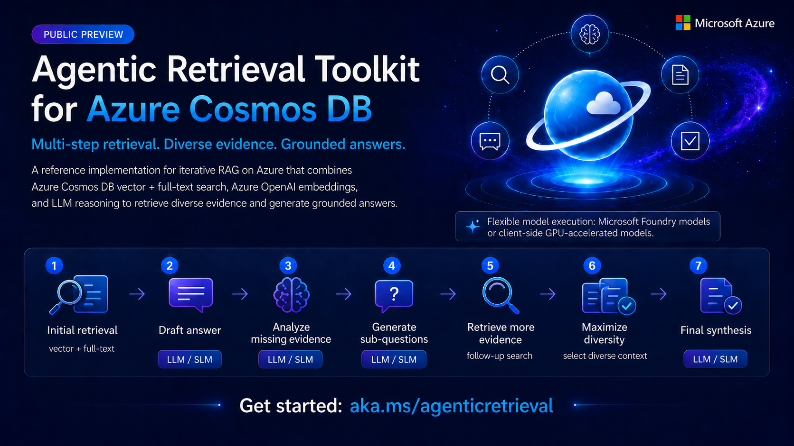

# Agentic Retrieval



Agentic Retrieval is a multi-stage agentic retrieval accelerator for answering complex questions that typically require multi-hop reasoning. It is a self-correcting RAG system that iteratively identifies knowledge gaps, retrieves targeted evidence, and generates more complete answers — built on Azure Cosmos DB for NoSQL and Microsoft Foundry.

Instead of relying on a single search-and-answer pass, the pipeline interleaves retrieval and reasoning across multiple rounds: it drafts a preliminary answer, analyzes what is still missing or under-supported, decomposes the gap into focused sub-questions, retrieves new evidence per sub-question across one or more Cosmos DB containers, and finally synthesizes a grounded answer from the accumulated context.

## Useful for scenarios with…

- **Complex questions** that span multiple topics or require information from many documents and modalities.
- **High-stakes applications** where answer completeness and accuracy matter (legal, medical, financial, real-estate, etc.).
- **Large heterogeneous corpora** where a single search query can't surface all relevant information.
- **Enterprise knowledge bases** with structured and unstructured data across multiple collections.

## How it works

Agentic Retrieval has two stages:

1. **Ingestion (`cosmos_db_upload.py`)**
   - Reads documents from one or more configured sources (JSONL by default; custom parsers for other formats such as XML).
   - Builds embeddings with the configured Azure OpenAI / Foundry endpoint and stores them in the per-source embedding field (e.g. `e`).
   - Upserts documents into Azure Cosmos DB containers with vector and full-text indexing enabled.

2. **Retrieval and answering (`dynamic_retriever.py`)**
   - Runs a decomposed RAG loop combining vector search, full-text search, diversity selection, and optional semantic reranking across all configured sources.
   - Iteratively generates sub-questions to fill knowledge gaps, retrieves targeted evidence for each, and synthesizes a final answer.
   - Writes per-question traces and grouped answer files under `out/`.

> **Note:** This package can optionally use the **Azure Cosmos DB Semantic Reranker**
> to reorder retrieved results by semantic relevance before answer synthesis. It is
> enabled via the `ranker` settings in `config.yaml` (set `ranker.use_ranker: true`)
> and can be left disabled if you don't have a reranker resource. Learn more:
> <https://aka.ms/build26/cosmosreranker>.

## What this project does

- Uploads your corpus to Cosmos DB through **configurable sources** (`cosmos.sources`), each mapping to a container.
- Embeds all sources with one configured embedding endpoint/model.
- Answers evaluation questions by combining:
  - Initial retrieval
  - Gap-aware sub-question decomposition
  - Regeneration/synthesis into a final answer

## Prerequisites

- Python 3.10+
- Azure Cosmos DB account + database/containers (or management settings for auto-create)
- Azure OpenAI (or local embedding endpoint if configured)

Install dependencies:

```bash
pip install -r requirements.txt
```

Or use setup helpers:

- PowerShell: `./run.ps1`
- Bash: `source ./run.sh`

## Sequence of actions

### 1) Populate `config.yaml`

Start from `config.yaml.example` and fill required values in `config.yaml`. Make sure to use the latest `config.yaml.example` as the format might have been updated.

At minimum, set:

- `llm.llm_endpoint`
- `llm.embed_endpoint`
- `llm.llm_model`
- `llm.embed_model`
- `llm.azure_openai_key` (if not using RBAC for OpenAI, i.e., `llm.use_rbac_auth: false`)
- `cosmos.uri`
- `cosmos.database_name`
- `cosmos.sources` (one or more source entries)
- `paths.output_root`

Each entry in `cosmos.sources` is configured independently and includes:

- `id`
- `container_name`
- `partition_key_path`
- `embedding_field` (document field that stores embedding vectors, e.g. `e`)
- `documents_root`
- `embedding_text_fields`
- `retrieval.vector_k`
- `retrieval.fulltext_k`
- `retrieval.fulltext_fields`
- `indexing_policy_json`
- `full_text_policy_json`

**Authentication options:**

- **Cosmos DB**: Uses Entra ID RBAC by default (`cosmos.use_rbac_auth: true`).
  - Set `cosmos.use_rbac_auth: false` to use key-based auth (requires `cosmos.key`).
  - For RBAC: Ensure your identity has the "Cosmos DB Built-in Data Contributor" role assigned.

- **Azure OpenAI**: Uses key-based auth by default (`llm.use_rbac_auth: false`).
  - Set `llm.use_rbac_auth: true` to use Entra ID RBAC (requires `llm.token_scope`).

Optional but recommended for auto-creating missing containers:

- `cosmos.azure_subscription_id`
- `cosmos.cosmos_resource_group`
- `cosmos.cosmos_account_name` (or let script infer from `cosmos.uri`)

### 2) Upload documents to Cosmos DB

Run:

```bash
python cosmos_db_upload.py --config config.yaml
```

Notes:

- Upload target(s) are inferred from configured `cosmos.sources` entries with non-empty `documents_root`.

### 3) Run retrieval and generate answers

Before running retrieval, prepare your questions file.

The repository includes a sample file at `data/questions-answers.json` with this structure:

```json
[
  {
    "question_id": "1",
    "question_text": "Your question here",
    "answer": "Ground-truth answer here"
  }
]
```

How to use it:

- Keep the same JSON array structure and field names (`question_id`, `question_text`, `answer`).
- Replace `question_text` values with questions your own dataset should be able to answer.
- Replace `answer` values with your own ground-truth answers (the expected/correct answers you define for evaluation).

Then run:

```bash
python dynamic_retriever.py --config config.yaml --questions-path path/to/questions.json
```

Both `--config` and `--questions-path` are required. `--config` specifies the YAML configuration file; `--questions-path` points to a single `.json` file containing the question array.

The paradigm is selected by `--mode {tool-use,decomposed}` (CLI flag) or `pipeline.mode` in YAML; the CLI overrides the config. The default when neither is set is `tool-use`.

Typical limited smoke test:

```bash
python dynamic_retriever.py --config config.yaml --questions-path data/questions-answers.json --max-questions 1
```

### 4) Generate timing summary table

Run:

```bash
python timing_summary.py
```

What this script does:

- Runs a fresh timed benchmark (`dynamic_retriever.py --mode decomposed --config config.yaml --questions-path <questions_file> --max-questions 5 --timing`).
- Parses key retrieval/LLM timing checkpoints from the terminal output.
- Writes a timestamped log in `out/` (`timing_5q_rerun_<timestamp>.log`).
- Updates `out/timing_5q_latest.log` with the newest run.
- Generates a table at `out/timing_5q_compare_table.tsv`:
  - If no previous latest log exists: prints/writes `Component` + `This run`.
  - If previous latest log exists: prints/writes `Component`, `Prev run`, `This run`, and `Change`.

Outputs are written to:

- `out/k.../intermediate/...` (per-question intermediate traces)
- `out/k.../questions_with_answers.json` (final grouped answers)

## Useful runtime overrides

These flags override the corresponding `config.yaml` values for a single run (decomposed mode unless noted):

- `--k-diverse` — number of diverse chunks to select via log-determinant (MMR-style) selection; `0` disables diversity selection.
- `--eta` — Gram-matrix regularization strength used by the diversity selection.
- `--rescale-power` — exponent applied to query-similarity scores when rescaling before diversity selection.
- `--max-sub-questions` — maximum number of gap-filling sub-questions generated per round.
- `--rounds` — number of decompose/retrieve/synthesize rounds to run.
- `--max-questions` — only answer the first N questions from the questions file (handy for smoke tests).
- `--max-workers` — number of questions processed concurrently.
- `--questions-path` — path to the questions `.json` file (overrides `paths.questions_path`).
- `--output-root` — directory where traces and answer files are written (overrides `paths.output_root`).

### `--timing` — wall-clock profiling

Add `--timing` to print a checkpoint line for every major operation as it completes:

```bash
python dynamic_retriever.py --mode decomposed --config config.yaml --questions-path data/questions-answers.json --max-questions 1 --timing
```

Each line has the form:

```text
  [TIMING] <label>: +<step_elapsed>s  (total <since_start>s)
```

Immediately before each Cosmos DB call, the actual query is also printed as a `[QUERY]` line.

## Repository layout

- `cosmos_db_upload.py` — ingestion + embedding + Cosmos upsert
- `dynamic_retriever.py` — decomposed RAG retrieval/answer pipeline
- `timing_summary.py` — timed rerun + timing comparison table generation
- `config.yaml.example` — sample data config template for files under `data/`
- `data/` — sample input corpus
- `docs/` — concepts and detailed usage docs for the root/sample-data pipeline
- `samples/` — standalone example apps built on the pipeline (see below)
- `out/` — generated outputs

## Samples

The `samples/` folder contains standalone apps that build on the retrieval pipeline:

- [`samples/QA_CLI`](samples/QA_CLI/) — an interactive terminal app to ask a question and compare retrieval strategies: **tool-use** (agentic function-calling loop), **decomposed** (Agentic Retrieval multi-round RAG), a single-shot **vector** search baseline, or **compare** to run all three side by side. See its [README](samples/QA_CLI/README.md) for setup and usage.

## Troubleshooting

- **Azure OpenAI auth errors (401/403)**
  - If using key auth (`llm.use_rbac_auth: false`), ensure `llm.azure_openai_key` is valid and maps to the configured endpoint.
  - If using RBAC (`llm.use_rbac_auth: true`), make sure your signed-in identity has Azure OpenAI access and `llm.token_scope` is correct.

- **Cosmos DB auth errors (403/Forbidden)**
  - If using RBAC (`cosmos.use_rbac_auth: true`, the default), ensure your identity has the appropriate Cosmos DB data plane role.
  - If using key auth (`cosmos.use_rbac_auth: false`), ensure `cosmos.key` is valid.

- **A source is skipped during upload**
  - Check source-level required fields:
    - `container_name`
    - `partition_key_path`
    - `documents_root`

- **Missing container during upload**
  - Auto-create works only when management settings are present:
    - `cosmos.azure_subscription_id`
    - `cosmos.cosmos_resource_group`
    - optional `cosmos.cosmos_account_name`

- **No questions processed / empty output**
  - Confirm `--questions-path` points to a `.json` file containing a JSON array of question objects.
  - Each object must have `question_id` and `question_text` fields.
  - Confirm `--output-root` (or `paths.output_root` in config) is writable.

- **Config error: `cosmos.sources` missing/empty**
  - Both upload and retrieval now fail fast when `cosmos.sources` is not a non-empty list.
  - Add at least one source entry under `cosmos.sources` with required properties.
