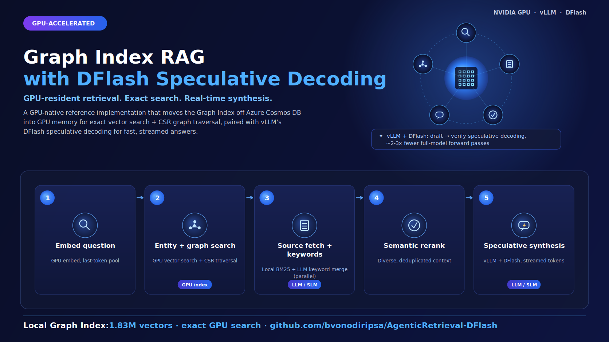

# Agentic Retrieval + Graph Index + DFlash



This repository extends the [AgenticRetrieval](https://github.com/bvonodiripsa/AgenticRetrieval) project with two major additions: a **Graph Index (GI)** retrieval layer, and **DFlash speculative decoding** for GPU-accelerated LLM inference. Together they deliver faster, higher-quality answers over the same food product dataset (58K documents, 1.6M graph index triples).

A FastAPI web application (`api.py`) serves a single pipeline — GI-RAG
retrieval + a speculative-decoding-capable LLM call — with a **retrieval
backend switch** (`index.mode` in the config) rather than separate app
backends:

| `index.mode` | Where the Graph Index lives | Retrieval speed (measured, co-located H100, warm) |
|---|---|---|
| `cosmos` | Azure Cosmos DB, queried over the network (original) | ~2.06-2.26s |
| `local` **(default in `my.yaml`)** | GPU memory + host RAM, a read-only snapshot exported from Cosmos | ~0.003-0.03s |

Cosmos DB remains the system of record either way; `local` mode serves a
snapshot built by `scripts/build_local_index.py` and swaps in automatically
in the background the first time it's missing (see "Local GPU-resident
Graph Index" below and `PROGRESS.md` for the full story, including the
traversal bug fix that made `reverse_edges` actually work). The older
"Original" (GPT-4.1 decomposed RAG) and plain "GI-RAG" (no DFlash) backends
described in earlier revisions of this README have been folded into the
single DFlash-capable pipeline below; the vendored upstream decomposed-RAG
code still exists at `external/agenticretrieval` and is exercised by
`samples/QA_CLI`, not by this app.

## What Changed from the Original

### Architecture changes

| Area | Original ([AgenticRetrieval](https://github.com/bvonodiripsa/AgenticRetrieval)) | This repo (AgenticRetrieval-DFlash) |
|------|--------------------------|------|
| **LLM** | Azure OpenAI GPT-4.1 (cloud API) | Qwen3.5-27B served locally via vLLM (FP8 quantized) |
| **Hardware** | No GPU required (cloud LLM) | 2x NVIDIA H100 NVL 96GB (Azure Standard_NC80adis_H100_v5) |
| **Retrieval** | Multi-round decomposed RAG: sub-question decomposition, gap-filling re-retrieval over 2+ rounds | Single-pass GI traversal: entity search → graph hop → source fetch, against Cosmos DB or a GPU-resident local snapshot (`index.mode`) |
| **Graph Index** | None — retrieves directly from document embeddings | 1.6M triples extracted from 58K documents; Cosmos DB is the system of record, optionally mirrored into GPU memory for query-time speed |
| **Embedding** | Azure OpenAI embedding endpoint | In-process `Qwen3-Embedding-0.6B` (1024 dims, no network call) |
| **Decoding** | Standard autoregressive | DFlash speculative: `z-lab/Qwen3.5-27B-DFlash` draft model proposes 5 tokens per step; main model verifies in a single forward pass |
| **Semantic Reranker** | Optional (disabled by default) | Integrated via Cosmos DB Semantic Reranker SDK (DFlash path) |
| **Keyword Search** | Built-in full-text search per source | LLM-expanded keyword generation + local BM25 or Cosmos `FullTextContains` (`index.mode`) |
| **Web UI** | CLI only (`dynamic_retriever.py`) | FastAPI + SSE streaming web app with real-time progress and timing |

### New files (not in the original)

| File | Purpose |
|------|---------|
| `gi_builder.py` | Offline Graph Index construction: triple extraction, dedup, predicate normalization, entity resolution |
| `gi_query.py` | Online GI-RAG query engine: backend selection/hot-swap, LLM answer assembly |
| `retrieval.py` | Single retrieval implementation (`retrieve()`) shared by both backends and both API endpoints |
| `gi_index.py` | GPU-resident local Graph Index backend: vector search, CSR graph traversal, local BM25 |
| `scripts/build_local_index.py` | Exports the Cosmos Graph Index into the local GPU-resident snapshot |
| `snapshot_freshness.py` + `scripts/check_snapshot_freshness.py` | Compares a local snapshot's manifest against live Cosmos counts/timestamps |
| `api.py` | FastAPI web app serving the GI-RAG + LLM pipeline with real SSE token streaming |
| `prompts_gi_food.py` | GI-specific prompts for triple extraction and answer generation |
| `static/index.html` | Web UI with progress log and timing display |
| `config.yaml.example` | Consolidated config template (copy to `my.yaml`, then fill in secrets) |
| `upstream.py` + `scripts/sync_upstream.*` | Vendor the upstream AgenticRetrieval repo into `external/agenticretrieval` (git-ignored, re-syncable) |
| `PROGRESS.md` / `results/*.md` | Dev log and measured benchmarks for the local Graph Index work (GB10 dev box + H100) |

## How the Pipeline Works

This app runs a single pipeline end to end (`api.py` → `retrieval.py` →
LLM call). Pipelines 2 and 3 from earlier revisions of this README — a
plain "GI-RAG" backend without DFlash, and a separate "GI-RAG + DFlash"
backend — have been merged: retrieval is always the parallel/keyword-
expanded/reranked version below, and the LLM call always uses whatever
speculative-decoding config the endpoint offers (DFlash, when the vLLM
server is started with `--spec-model`). What varies at runtime is only the
**retrieval backend** (`index.mode: cosmos` vs `local`, see above), not the
pipeline shape. Pipeline 1 (the original decomposed RAG) is kept below as
the quality/latency baseline this whole repo is measured against; it still
runs, unmodified, via the vendored `external/agenticretrieval` code and
`samples/QA_CLI`, not through `api.py`.

### Pipeline 1: Original AgenticRetrieval (decomposed multi-round RAG)

This is the upstream [AgenticRetrieval](https://github.com/bvonodiripsa/AgenticRetrieval) pipeline running unmodified. It is the quality baseline.

```
Question
  │
  ├─► Round 1: Vector + full-text search → initial answer
  │
  ├─► Gap analysis: identify missing knowledge
  │
  ├─► Round 2: Decompose gaps into sub-questions
  │      ├─► Sub-question 1 → targeted retrieval
  │      ├─► Sub-question 2 → targeted retrieval
  │      └─► ...
  │
  └─► Final synthesis: combine all evidence → answer
```

- **LLM**: GPT-4.1 via Azure OpenAI (cloud, ~30-40 tok/s)
- **Retrieval**: `CombinedRetriever` from the vendored `dynamic_retriever.py` (`external/agenticretrieval`) — vector search (k=35) + full-text search (k=15) per source container, with diversity selection
- **Rounds**: 2 decompose/retrieve/synthesize rounds by default
- **Strengths**: Highest answer completeness (10+ products, detailed reasoning); gap-aware re-retrieval catches information missed in the first pass
- **Weakness**: Slowest — multiple LLM calls + multiple retrieval rounds (70-94s total)

### Pipeline 2: GI-RAG + DFlash (this repo's pipeline — parallel retrieval + speculative decoding)

Single-pass retrieval through the Graph Index (Cosmos DB or the local
GPU-resident snapshot — `index.mode`), with parallel retrieval paths and
speculative decoding.

```
Question
  │
  ├─► Embed question (Qwen3-Embedding-0.6B, in-process)
  │
  ├─► PARALLEL:
  │      ├─► Entity search (vector, top 10)
  │      └─► LLM keyword expansion (5-8 food-related search terms)
  │
  ├─► PARALLEL:
  │      ├─► Graph traversal (`index.mode: local` — CSR adjacency, forward + reverse hops; `cosmos` — PK-based hop, forward only)
  │      ├─► Food vector search
  │      └─► Full-text keyword search (local BM25, or Cosmos `FullTextContains`)
  │
  ├─► Merge + deduplicate all results
  │
  ├─► Semantic reranker (Cosmos DB AI reranker, top 25)
  │
  └─► Single LLM call (Qwen3.5-27B + DFlash draft model, real token streaming) → answer
```

- **LLM**: Qwen3.5-27B via vLLM with DFlash speculative decoding (~110-140 tok/s, 2-2.5x speedup)
- **Retrieval**: All search paths run concurrently via `asyncio.gather`, implemented once in `retrieval.py` for both backends; reduced context limits (40 triples, 15 source chunks) to minimize prompt tokens. Retrieval itself is ~2s on Cosmos vs ~sub-30ms on the local GPU index — see `PROGRESS.md` / `results/h100_comparison.md`
- **Keyword expansion**: LLM generates additional food-related search terms (e.g., "protein bar", "energy", "peanut") merged into the full-text search above
- **Semantic reranker**: Cosmos DB Semantic Reranker re-orders retrieved documents by relevance before prompting the LLM
- **Strengths**: Fastest pipeline; lossless quality (DFlash output is mathematically identical to standard decoding); real token streaming (time-to-first-token ~0.5s, not a wait-for-full-completion-then-chunk fake stream)

## How DFlash Speculative Decoding Works

DFlash is a speculative decoding technique that accelerates LLM inference without changing the output distribution.

```
Standard decoding (1 token per forward pass):
  Step 1: [prompt] → token_1
  Step 2: [prompt, token_1] → token_2
  Step 3: [prompt, token_1, token_2] → token_3
  ... (N forward passes for N tokens)

DFlash speculative decoding (up to 6 tokens per forward pass):
  Step 1: Draft model proposes [d1, d2, d3, d4, d5]  (cheap, ~1B params)
  Step 2: Main model verifies all 5 in ONE forward pass
  Step 3: Accept first K correct tokens, reject the rest
  Step 4: Repeat from the first rejected position
```

- **Draft model**: `z-lab/Qwen3.5-27B-DFlash` — a small model (~1B params) trained to mimic Qwen3.5-27B's token distribution
- **Verification**: The main Qwen3.5-27B model checks all draft tokens in a single batched forward pass
- **Acceptance rate**: Typically 60-80% of draft tokens are accepted, yielding 2-2.5x effective throughput
- **Lossless**: The rejection-sampling scheme guarantees the output distribution is identical to standard autoregressive generation

### vLLM configuration

```bash
vllm serve Qwen/Qwen3.5-27B \
  --tensor-parallel-size 2 \
  --max-model-len 16384 \
  --max-num-batched-tokens 16384 \
  --gpu-memory-utilization 0.92 \
  --dtype float16 \
  --quantization fp8 \
  --spec-model z-lab/Qwen3.5-27B-DFlash \
  --spec-tokens 5 \
  --enable-prefix-caching \
  --port 8000
```

Drop `--gpu-memory-utilization` to `0.85` if `index.mode: local` and the GPU
embedder are also loaded on the same GPUs — `0.92` OOM'd in that
configuration on a 2x H100 NVL 96GB box (see `SETUP.md`).

## How to Build the Graph Index

The graph index is built offline using `gi_builder.py`. It reads food product documents from Cosmos DB, extracts structured triples via LLM, post-processes them, and stores the graph index back to Cosmos DB.

### GI build pipeline

1. **Read documents** from the `food` container in Cosmos DB (all 58K or a question-driven subset via vector search)
2. **Extract triples** using Qwen3.5-27B with decomposed extraction:
   - Round 1: Initial extraction from product fields (title, ingredients, claims, nutrition)
   - Round 2+: Gap analysis identifies missing knowledge, targeted extraction fills gaps
3. **Dedup + confidence boost**: Merge duplicate triples; boost confidence when triples are re-confirmed across documents
4. **Normalize predicates**: LLM batches standardize free-form predicates into a controlled vocabulary (`has_ingredient`, `contains_allergen`, `suitable_for_occasion`, `has_cooking_method`, etc.)
5. **Entity resolution**: Embedding-based clustering (cosine similarity > 0.85) + LLM merge verification to unify variant entity names
6. **Store to Cosmos DB**: Upsert triples and entities with embeddings to `triples` and `entities` containers

### CLI usage

```bash
# Full GI build
python gi_builder.py --config my.yaml

# Question-driven subset (faster for testing)
python gi_builder.py --config my.yaml --question-driven --question-k 30

# Resume from checkpoint
python gi_builder.py --config my.yaml --time-limit 3600

# Skip extraction, only run post-processing
python gi_builder.py --config my.yaml --skip-extraction --reprocess
```

### Triple schema in Cosmos DB

```json
{
  "id": "triple-hash",
  "pk": "reeses sticks",
  "subject": "Reese's Sticks",
  "predicate": "has_ingredient",
  "object": "peanut butter",
  "confidence": 0.95,
  "confirmations": 3,
  "source_chunks": ["doc-abc123"],
  "embedding": [0.012, -0.034, ...]
}
```

### Inferred semantic triples

Beyond extracting facts directly from product data, the builder infers higher-level semantic triples:

- **Occasions**: breakfast, snack, dessert, BBQ, cinema, picnic
- **Cooking methods**: ready to eat, microwave, air fryer, grill, oven
- **Convenience**: instant, under 5 min, under 15 min, requires cooking
- **Nutrition**: high protein, high calorie, low sugar, low fat, keto-friendly
- **Portability**: pocket sized, single serving, family size
- **Audience**: athletes, health conscious, families, children

## Configuration Reference

The app is driven by a single YAML config: copy `config.yaml.example` to `my.yaml`
(git-ignored) and fill in your Cosmos DB, embedding, and LLM settings + secrets.
Override the path with `--config <file>`.

### Retrieval backend (`index:` block)

| Setting | Value | Purpose |
|---------|-------|---------|
| `mode` | `"cosmos"` or `"local"` | Query Cosmos DB over the network, or a GPU-resident snapshot |
| `snapshot_path` | `"data/local_index"` | Where the local snapshot lives (git-ignored; built by `scripts/build_local_index.py`) |
| `device` | `"cuda"` | Device for the local index's vectors |
| `enable_bm25` | `true` | Local BM25 full-text search (replaces `FullTextContains` in local mode) |
| `reverse_edges` | `true` | Also traverse `object -> subject`; needs the local index (Cosmos can't do this cheaply) |
| `auto_build` | `true` | If the snapshot is missing, serve Cosmos immediately and build the snapshot in the background, swapping in once ready |
| `check_freshness` | `true` | Background warning (not an automatic rebuild) if the snapshot is stale vs. live Cosmos |

See `config.yaml.example` for full inline documentation of each setting, and
`PROGRESS.md` for how the hot-swap and freshness check behave in practice.

### Key query settings (`query:` block)

| Setting | Value | Purpose |
|---------|-------|---------|
| `seed_entities_k` | 10 | Seed entities from vector search |
| `max_hops` | 2 | Graph traversal depth |
| `max_triples` | 40 | Triples passed to the LLM |
| `max_source_chunks` | 15 | Source documents fetched |
| `vector_augment_k` | 12 | Extra vector-search products |
| `max_answer_tokens` | 4096 | Answer budget (covers reasoning tokens) |

Embeddings are computed in-process (Qwen3-Embedding-0.6B, mean-pool + L2, GPU
if available). The Cosmos DB semantic reranker reorders sources before the
LLM call; if it is unavailable the pipeline falls back to vector-search
ordering. Keyword search is LLM-expanded, then run against local BM25 or
Cosmos `FullTextContains` depending on `index.mode`.

## Hardware Requirements

| Component | Specification |
|-----------|--------------|
| **GPU** | 2x NVIDIA H100 NVL 96GB (for vLLM with tensor parallelism); a single GPU dev box (e.g. NVIDIA GB10) works for retrieval-only development and testing, see `PROGRESS.md` |
| **VM** | Azure Standard_NC80adis_H100_v5 (96 vCPU, 1.9TB RAM) |
| **Disk** | 256GB+ for model weights and checkpoints |
| **Network** | Azure VNet with NSG rules for port 8080 (web UI) |

vLLM (the LLM) needs the GPU(s); Cosmos DB access is needed either for live
`index.mode: cosmos` queries or, in `local` mode, only to (re)build the
snapshot — day-to-day queries in `local` mode don't touch Cosmos at all.

### vLLM memory layout (2x H100)

| Component | Memory |
|-----------|--------|
| Qwen3.5-27B weights (FP8) | ~27 GB across 2 GPUs |
| DFlash draft model | ~1 GB |
| KV cache | ~50 GB (FP8, 16K context) |
| CUDA overhead | ~10 GB |
| **Total** | ~88 GB / 160 GB available |

## Benchmark Results

**For the current local-GPU-index numbers** (retrieval 2.06s → 0.003-0.03s,
end-to-end ~1.55x on top of that), see `PROGRESS.md` and
`results/h100_comparison.md` / `results/optimization_gb10.md`. The tables
below are the `index.mode: cosmos`-only numbers from before that work
landed, kept for historical comparison.

**Hardware**: 2x NVIDIA H100 NVL (Sweden Central) | **Database**: Cosmos DB (Sweden Central, co-located) — 58K food products, 1.6M triples, 180K entities

### Per-question timing (Q1: "high-calorie protein snack for running belt")

| Stage | Time |
|-------|------|
| Embed | 0.27s |
| Entity Search | 0.33s |
| Graph Traversal | 0.83s |
| Source Fetch | 0.26s |
| LLM (DFlash) | 7.71s |
| **Total** | **9.40s** |

### Full pipeline (web app, warm)

| Stage | Time |
|-------|------|
| Embed | 0.30s |
| Entity Search | 0.84s |
| Graph Traversal (parallel) | 1.40s |
| Source Fetch | 0.40s |
| LLM (DFlash) | 3.46s |
| **Total** | **6.40s** |

### Region co-location impact

Co-locating Cosmos DB and the VM in the same Azure region reduced retrieval latency by 5-10x:

| Query | Cross-region | **Co-located** | Speedup |
|-------|-------------|---------------|---------|
| Baseline (no vector) | 0.50s | **0.10s** | 5x |
| Entity vector (180K docs) | 0.51s | **0.30s** | 1.7x |
| Triple vector (1.6M docs) | 0.52s | **0.35s** | 1.5x |

### Quality

- DFlash speculative decoding is **mathematically lossless** — output quality is identical to standard Qwen3.5-27B generation
- Keyword expansion and semantic reranking improve product coverage
- Answers include 5-10 product recommendations with reasoning

## Running the Web Application

### Prerequisites

1. Azure Cosmos DB account with `food`, `entities`, `triples` containers populated. Required always as the system of record; with `index.mode: local` and an existing snapshot, live Cosmos access is no longer needed on the query path (only to rebuild the snapshot)
2. vLLM server running on port 8000 (see vLLM configuration above)
3. Azure CLI logged in (`az login`) for Cosmos DB RBAC
4. Semantic reranker endpoint set in the config (`cosmos.semantic_reranker_endpoint`); an `AZURE_COSMOS_SEMANTIC_RERANKER_INFERENCE_ENDPOINT` env var overrides it
5. If using `index.mode: local` for the first time: either build the snapshot up front (`python scripts/build_local_index.py --config my.yaml --out data/local_index`) or leave `index.auto_build: true` and let the app build it in the background on first start (serves from Cosmos in the meantime, swaps over automatically)

### Start the web app

```bash
pip install -r requirements-web.txt

# The app reads a single config (default my.yaml; override with --config).
# The Cosmos reranker endpoint comes from cosmos.semantic_reranker_endpoint.
python api.py --config my.yaml --host localhost --port 8080
```

To launch with uvicorn directly (e.g. to pass extra uvicorn flags), set the
config via the `GI_CONFIG` environment variable instead:

```bash
GI_CONFIG=my.yaml \
  python -m uvicorn api:app --host localhost --port 8080 --timeout-keep-alive 120
```

### API endpoints

| Endpoint | Method | Description |
|----------|--------|-------------|
| `/` | GET | Web UI |
| `/health` | GET | Health check |
| `/v1/backends` | GET | Available backends with descriptions |
| `/v1/questions` | GET | Benchmark questions |
| `/v1/ask/stream` | POST | SSE streaming answer (`{"question": "..."}`) |
| `/v1/ask` | POST | JSON response (non-streaming) |

### SSE event format

```
data: {"stage": "progress", "message": "Embedding question...", "_ts": 0.0}
data: {"stage": "progress", "message": "Found 10 entities in 1.3s", "_ts": 1.3}
data: {"stage": "stats", "entities": 10, "triples": 40, "sources": 65}
data: {"stage": "answer_chunk", "text": "Based on the provided data..."}
data: {"stage": "done", "timings": {"embed": 0.3, "entity_search": 1.3, ...}}
```

## Azure Cosmos DB Semantic Reranker

The DFlash pipeline integrates the [Cosmos DB Semantic Reranker](https://learn.microsoft.com/en-us/azure/cosmos-db/gen-ai/semantic-reranker) to re-order retrieved documents by semantic relevance before passing them to the LLM.

### Setup

1. Enable the Semantic Reranker on your Cosmos DB account via the Azure portal
2. Register the provider: `az provider register -n Microsoft.InferenceService`
3. Assign the "Semantic Reranker User" role on the **InferenceService** resource:
   ```bash
   az role assignment create \
     --role "Semantic Reranker User" \
     --assignee-object-id "<your-user-object-id>" \
     --assignee-principal-type "User" \
     --scope "/subscriptions/<sub>/resourceGroups/<rg>/providers/Microsoft.InferenceService/inferenceAccounts/<account>"
   ```
4. Set the endpoint in your config (recommended):
   ```yaml
   cosmos:
     semantic_reranker_endpoint: "https://<account>.<region>.dbinference.azure.com"
   ```
   Or export an env var to override the config:
   ```bash
   export AZURE_COSMOS_SEMANTIC_RERANKER_INFERENCE_ENDPOINT="https://<account>.<region>.dbinference.azure.com"
   ```

The reranker is called after retrieval and before the LLM, reordering source documents by relevance to the question. If the reranker call fails (e.g., RBAC not configured), the pipeline falls back to vector-search ordering.

## Repository Layout

```
AgenticRetrieval-DFlash/
├── api.py                      # FastAPI web app (single GI-RAG + LLM pipeline)
├── retrieval.py                 # Single retrieval implementation, shared by both backends
├── gi_index.py                  # GPU-resident local Graph Index backend (vectors, CSR traversal, BM25)
├── gi_query.py                  # Query engine: backend selection/hot-swap, LLM answer assembly
├── gi_builder.py                # Offline Graph Index construction
├── snapshot_freshness.py        # Local-snapshot-vs-live-Cosmos staleness check
├── prompts_gi_food.py           # GI-specific prompts
├── upstream.py                  # Bootstrap for the vendored upstream clone
├── static/index.html            # Web UI
├── config.yaml.example          # Consolidated config template (copy to my.yaml)
├── scripts/build_local_index.py       # Cosmos -> local GPU snapshot exporter
├── scripts/check_snapshot_freshness.py # CLI wrapper for snapshot_freshness.py
├── scripts/sweep_max_hops.py          # query.max_hops tuning helper
├── benchmark_compare.py         # Cosmos vs. local-index retrieval comparison
├── external/agenticretrieval/   # Vendored upstream (git-ignored; sync_upstream.*)
├── data/local_index/            # Local GPU-index snapshot (git-ignored; built, not committed)
├── data/questions-answers.json  # Benchmark questions
├── PROGRESS.md                  # Dev log: local Graph Index work, GB10 + H100 findings
├── results/*.md                 # Measured benchmark tables (baseline, optimization, H100 comparison)
├── ARCHITECTURE.md              # Detailed code-level architecture
├── BENCHMARKS.md                # Historical timing benchmark tables (Cosmos-only, pre-local-index)
├── GI_AND_DFLASH.md             # Detailed Graph Index + DFlash explanation
├── requirements-web.txt         # Web app dependencies
├── requirements.txt             # Full dependencies
└── out_gi/                      # Benchmark outputs
```

## License

MIT — see [LICENSE](LICENSE).
