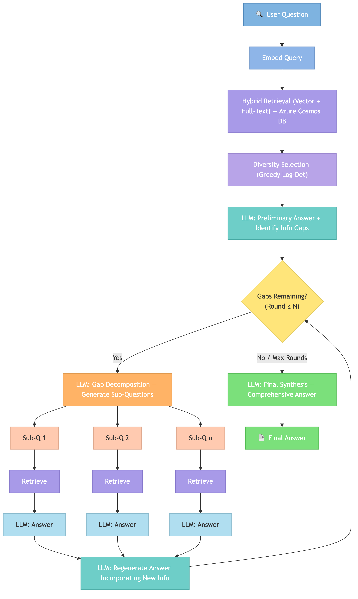

# Introduction

### What is Agentic Retrieval?

- A multi-round, self-correcting RAG pipeline that goes beyond single-shot retrieval.
- The system identifies what it doesn't know after the first retrieval pass, then autonomously retrieves more to fill those gaps.
- Combines hybrid search (vector + full-text) with diversity-aware document selection and iterative gap-filling.

### Why single-shot RAG falls short

- Traditional RAG does one retrieval pass — if the top-k documents miss key information, the answer is incomplete.
- Complex, multi-faceted questions often require information scattered across many documents.
- Single retrieval can return redundant documents that all say the same thing, wasting the context window.

### How Agentic Retrieval solves this

1. **Hybrid retrieval** — Combines semantic (vector) search with keyword (BM25 full-text) search for broader recall.
2. **Diversity selection** — Uses a greedy log-determinant algorithm to select documents that are maximally diverse, reducing redundancy and maximizing information coverage.
3. **Gap-aware decomposition** — After the first answer, the LLM explicitly identifies information gaps and generates targeted sub-questions.
4. **Iterative refinement** — Each round retrieves new documents for each sub-question, answers them, and regenerates a progressively more complete answer.
5. **Final synthesis** — All evidence is synthesized into a comprehensive, well-grounded response.

### Key differentiators

- **Self-aware** — the system knows what it doesn't know; it explicitly tracks information gaps.
- **Adaptive** — sub-questions are generated dynamically based on actual gaps, not predetermined templates.
- **Diverse by design** — log-det diversity selection is a principled mathematical approach (maximizing the volume of the selected document set in embedding space) rather than ad-hoc deduplication.
- **Multi-source** — supports multiple Cosmos DB containers/collections, each with independent retrieval settings.
- **Configurable depth** — number of rounds, sub-questions, concurrency, and diversity parameters are all tunable.

### The diversity selection edge

- Based on log-determinant maximization of the Gram matrix — selects documents that span the widest possible region of the embedding space.
- Optional query-relevance rescaling biases diversity toward documents already relevant to the query.
- Mathematically grounded: equivalent to maximizing the volume of the parallelotope formed by selected embedding vectors.
- Results in less redundancy and more informative context for the LLM.

## How It Works 

### Step 1: Cast a Wide Net — Initial Retrieval

The pipeline starts by converting the user's question into an embedding vector and searching across all configured Azure Cosmos DB sources. For each source, it runs two searches in parallel:

- **Vector search** finds documents whose embeddings are semantically closest to the question (meaning similar).
- **Full-text search** (BM25) finds documents that share important keywords with the question.

The results from both searches are merged together and deduplicated. This gives us a broad candidate pool — documents that are relevant by meaning, by keywords, or both.

### Step 1b: Pick the Most Diverse Subset — Diversity Selection

If diversity selection is enabled, the algorithm narrows down the candidate pool to avoid redundancy. It does this using a technique called Greedy Log-Det Selection:

1. Start by scoring every candidate by the "size" of its embedding vector.
2. Pick the highest-scoring candidate — this is the most informative document.
3. Mathematically project out the direction that document covers, so no remaining candidate gets credit for repeating that same information.
4. Re-score everything and pick the next best. Repeat until we've selected the desired number of diverse documents.

The result is a set of documents that covers as much ground as possible — instead of five documents all saying the same thing, you get five documents each bringing something new to the table. Optionally, relevance to the original query can be used to bias diversity toward documents that are already on-topic.

### Step 2: Take a First Pass — Preliminary Answer

The diverse set of retrieved documents is passed to the LLM along with the user's question. The LLM is asked to do two things:

1. **Answer the question** using only what's in the provided documents.
2. **Explicitly identify information gaps** — what parts of the question couldn't be fully answered from the available context.

This self-awareness is key: the system now knows exactly what it's missing.

### Step 3: Fill the Gaps — Iterative Refinement

This is where the "agentic" behavior kicks in. For each round (typically 2):

- **3a. Gap Decomposition** — The LLM looks at its current answer and the identified gaps, then generates a set of focused sub-questions — small, targeted queries designed to find the missing information. For example, if the original question was about a planet's climate and composition but the first retrieval only covered climate, a sub-question might be *"What is the chemical composition of Planet X's atmosphere?"*

- **3b. Answer Each Sub-Question** — Each sub-question goes through the same retrieval pipeline (hybrid search + diversity selection), pulling in fresh documents. The LLM then answers each sub-question from its own retrieved context. These sub-question retrievals run in parallel with bounded concurrency to balance speed and rate limits.

- **3c. Regenerate the Answer** — The LLM takes its previous answer and merges in all the new information from the sub-questions, producing an updated, more complete answer — along with any remaining gaps. If there are more rounds to go, the process loops back to decompose any remaining gaps.

If at any point the LLM finds no gaps to fill, the loop exits early — the answer is already complete.

### Step 4: Bring It All Together — Final Synthesis

After all rounds are complete, a final LLM call synthesizes everything:

- The original preliminary answer
- All sub-question answers from every round
- Any regenerated intermediate answers

The result is a comprehensive, well-grounded final answer that directly addresses the original question with minimal information gaps.